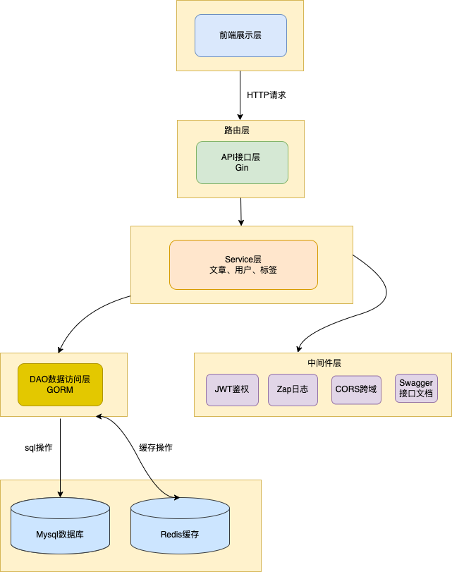
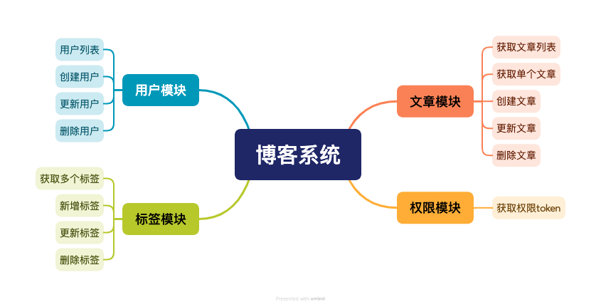
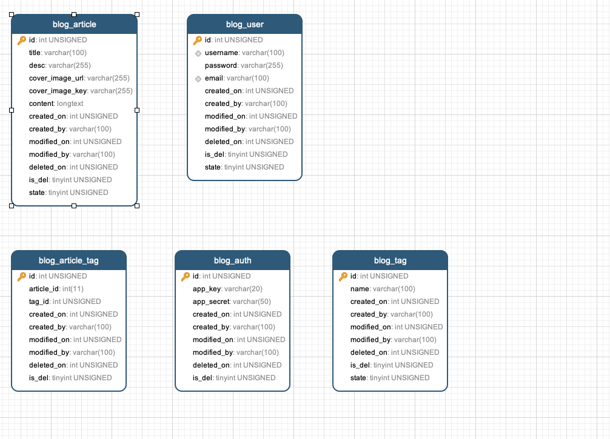

## 项目介绍
本文将介绍如何使用Go技术栈搭建一个现代化的博客系统。该系统采用前后端分离架构，集成了多个实用功能模块，并使用了当前流行的技术栈进行开发。

## 系统架构

### 整体架构图

### 功能模块划分

## 技术栈详解

### 后端技术
- 主语言: Go    
- Web框架: Gin
- 数据库: MySQL
- ORM框架: GORM
- 缓存: Redis
- 认证: JWT
- 日志: Zap
- API文档: Swagger
- 对象存储: MinIO/阿里云OSS

### 数据库设计
#### ER图

### 部署相关
- 容器化: Docker
- 编排工具: Docker Compose
- 服务器: 阿里云ECS
- 自动化部署: GitHub Actions

### 配置管理
- 配置格式: YAML
- 支持特性:
  - 本地数据库配置
  - 远程数据库配置
  - 环境变量配置

## 目录结构
GO_BLOG_SERVICE    
├── configs              # 配置文件目录
│   ├── sql             # SQL脚本
│   ├── config.yaml     
│   └── config.yaml.template 
├── docs                 # 文档目录
├── global              # 全局变量
├── internal            # 内部包
│   ├── dao            # 数据访问层
│   ├── middleware     # 中间件
│   ├── model         # 数据模型
│   ├── routers       # 路由
│   └── service       # 业务逻辑层
│       ├── article.go 
│       ├── auth.go    
│       ├── service.go # 基础服务
│       ├── tag.go     
│       └── user.go    
├── pkg                 # 公共包
│   ├── app            # 应用程序相关
│   ├── convert        # 数据转换
│   ├── errcode        # 错误码
│   ├── logger         # 日志
│   ├── minio          # MinIO对象存储
│   ├── redis          # Redis缓存
│   ├── setting        # 配置
│   └── util           # 工具函数
├── scripts            # 脚本文件
├── storage/logs       # 日志存储
├── third_party        # 第三方依赖
├── .gitignore        
├── deploy.sh          # 部署脚本
├── docker-compose.yml.bak 
├── Dockerfile         # Docker构建文件
├── go.mod            # Go模块文件
├── go.sum            # Go依赖校验文件
├── LICENSE           
├── main.go           # 程序入口
└── README.md         # 项目说明文档

### 待完善开发功能
1. 注册用户接口密码做加密措施
2. 评论模块
3. 点赞模块
4. cobar命令行
5. nullString问题

## 未来规划
1. 使用nginx或traefik做API网关
2. 使用Elasticsearch做全文搜索
3. ELK stack做日志管理
4. Casbin做权限控制
5. 定时任务
6. Oauth2.0

本项目采用模块化设计，遵循清晰的分层架构，便于后期维护和扩展。通过使用Docker和自动化部署工具，实现了高效的开发和运维流程。

