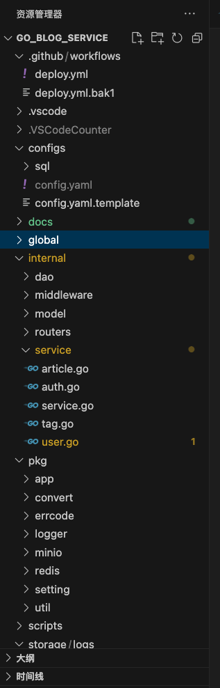

用go技术栈搭建了一个博客博客系统,包含如下模块

#### 标签模块
获取多个标签
新增标签
更新标签
删除标签

#### 文章模块
获取文章列表
获取单个文章
创建文章
更新文章
删除文章

#### 用户模块
用户列表
创建用户
更新用户
删除用女户

获取权限token

使用JWT鉴权
github  action做自动化部署
数据库  Mysql
数据库持久化
缓存  Redis
docker做部署
阿里云服务器
minIO做文件存储
阿里云oss做文件存储
docker-compose做部署
yaml 支持远程和本地数据库配置
日志系统 zip
swagger 生成接口文档

开发的模块
用到的技术栈
对目录结构做下分析
未来打算做的模块